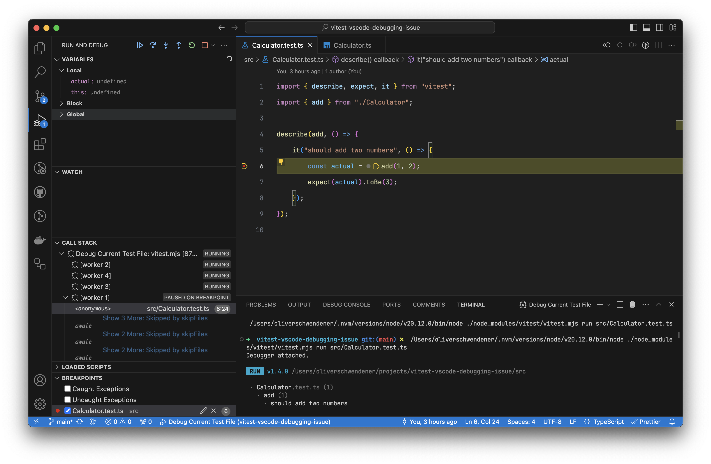
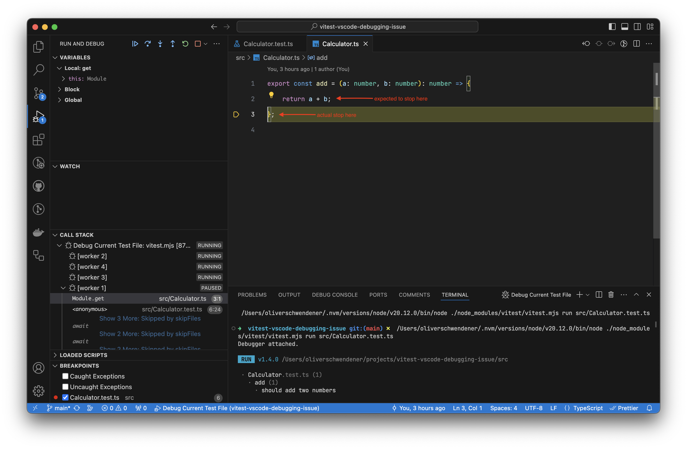

# Vitest VSCode debugging issue

This repo demonstrates an issue when debugging test files with vitest in Visual Studio Code.

Steps to reproduce:

- Install dependencies:
  ```
  $ pnpm install
  ```
- Open `Calculator.test.ts` with Visual Studio Code and create a breakpoint on line 6
- Run "Debug Current Test File" or press F5
- The debugger will stop on line 6 as expected, see screenshot:
  
- Press F11 or "Step into" to step into the `add` function, defined in `Calculator.ts`
- Instead of stopping on line 2 in `Calculator.ts` it stops at the end of the file, see screenshot:
  